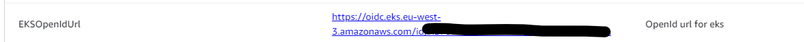

# Topic 9 - java web application Run+CI/CD in  KUBE(EKS+Jenkins+EFS+ALB+CKS+ECR)
##  Yuanchao Hands-on Project

## This readme is more readable [here](https://github.com/lyc-handson-aws/handson-topic9)

## **Overview**

**Project's main features**
:point_right: EKS Cluster

:point_right: EFS usage in EKS environment

:point_right: ALB(ELB) usage in EKS environment

:point_right: CKS practice in EKS environment

:point_right: Jenkins instance in EKS environment

:point_right: simple java application pod with CKS + Jenkins CI/CD in EKS environment

## What could be learned in this topic:

1. How to create an EKS Cluster with necessaire AWS Roles to interact with other used AWS resource in this Topic
2. How to install/configure/utilize EFS CSI Controller in EKS via helm
3. How to install/configure/utilize AWS Load Balancer Controller in EKS via helm
4. How to install/expose Jenkins service in a KUBE Cluster(EKS) with(EFS/ALB) via helm
5. How to pre-configure Jenkins instance in a KUBE Cluster(EKS) via helm(some are simple implementations)
   1. pre-installed plugins
   2. pre-defined podTemplate/agent
   3. JCasC(Jenkins Configuration as Code):securityRealm,authorizationStrategy(RBAC), pre-defined secrets/credentials...

6. How to build/expose a java web application in EKS environment using ALB  + CKS practice
7. Pod's CI with Jenkinsfile of a 'Jenkins in KUBE' - Code Build/Code Test/Image Build/Image Push(ECR)/Github workflow launch for deployment
8. CKS subject's integration with a real EKS environment, see CKS subjects(not all subjects are in the list)

## CKS subjects

The below subjects are covered in the auto-deployment of the topic (for deployment namespaces)

- Network Policies
- CIS Benchmarks(cronjob)
- Container Runtime sandbox(gVisor)
- Container's immutability at runtime
- OPA(open policy agent)
- Pod' OS Level Security Domains
- ServiceAccount using
- Node Metadata Protection

The below subjects are the actions that need to be applied manually on the KUBE work nodes, so they can not really be seen inside this topic

- Apparmor/Seccomp usage for kernel Hardening
- Falcon/Strace usage for Runtime Security - Behavioral Analytics
- Clair/Trivy for Image Vulnerability Scanning
- Kubesec for KUBE Conf Static Analysis

The below subjects are not possible with a managed KUBE Cluster like EKS(need access to master node/API Server configuration file), normally AWS already take care of them or user need to activate them by Add-on

- Audit enabling
- ImagePolicyWebhook
- ETCD Encryption
- Upgrade KUBE
- RBAC

## **Architecture**

the diagram below illustrates the architecture(principle) of this project:

## Continue Deployment
1. CloudFormation stack's deployment: see GitHub workflows https://github.com/lyc-handson-aws/handson-topic9/blob/main/.github/workflows/action-cf.yaml
2. after the stack is complete, retrieve from stack's output or ESK Cluster page the Openid URL like the one in the below image, follow this doc https://docs.aws.amazon.com/eks/latest/userguide/enable-iam-roles-for-service-accounts.html to create an IAM OIDC provider for your cluster
   
3. before proceed to the step 5 for 'installing EFS CSI driver', go through this doc https://docs.aws.amazon.com/eks/latest/userguide/efs-csi.html to create a AWS Role that will be referred by the EFS CSI controller 's service account of step 5
4. before proceed to the step 5 for 'installing ALB Controller', go through this doc  https://docs.aws.amazon.com/eks/latest/userguide/lbc-helm.html#lbc-helm-iam to create a AWS Role that will be referred by the ALB controller 's service account of step 5
5. Set up for EFS CSI Controller/Load Balancer Controller/Jenkins instance/CKS OPA: see GitHub workflows https://github.com/lyc-handson-aws/handson-topic9/blob/develop/.github/workflows/action-eks.yaml
6. Java applications' CI(jenskinfile): see https://github.com/lyc-handson-aws/handson-topic9/blob/develop/java-app/Jenkinsfile
7. Java application's deployment triggered at the end of jenkinsfile: see GitHub workflows https://github.com/lyc-handson-aws/handson-topic9/blob/main/.github/workflows/action-app.yaml

## **CloudFormation Stack Quick-create Link**
Click here to quickly create a same project with the same AWS resources:  [here](https://eu-west-3.console.aws.amazon.com/cloudformation/home?region=eu-west-3#/stacks/create/review?templateURL=https://s3bucket-handson-topic1.s3.eu-west-3.amazonaws.com/CF-template-handson-topic9.yaml)
**for this topic the stack create only the the basic EKS cluster/EFS Instance/ECR Repo, most other actions needs manual/automated set up of other tools or resources.**

**in this stack, you need to provide your own SUBNET/SUCRURITY on AWS**

> the default stack's region "Europe (Paris) eu-west-3"

## **AWS Resources**
Project's AWS resources:

:point_right: AWS::EKS::Cluster - with AmazonEKSClusterPolicy(AWS Role)

:point_right: AWS::EKS::Nodegroup -  type FARGATE, desiredsize 2, minsize 1, maxsize 3 with AmazonEKSWorkerNodePolicy/AmazonEKS_CNI_Policy/AmazonEC2ContainerRegistryReadOnly(AWS Role)

:point_right: AWS::EFS::FileSystem - define EFS instance

:point_right: AWS::EFS::AccessPoint - define the agreed user/group and file's owner that will be used by Jenkins

:point_right: AWS::EFS::MountTarget - 2 are defined for matching 2 subnets where EKS Cluster are located

:point_right: AWS::ECR::Repository - the ECR Repo for application image

